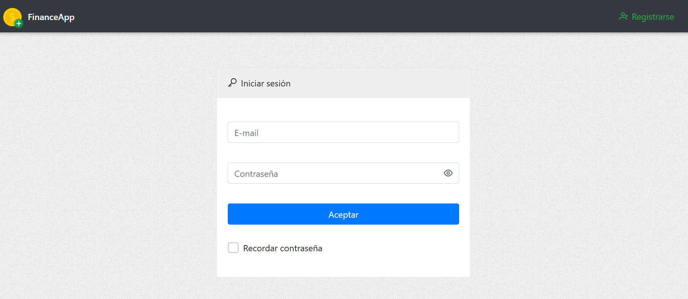
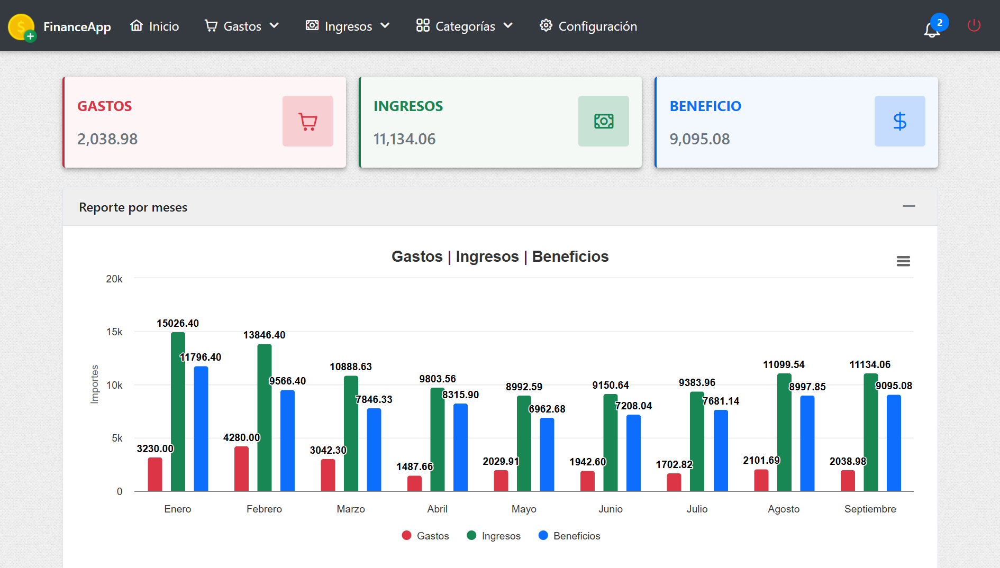
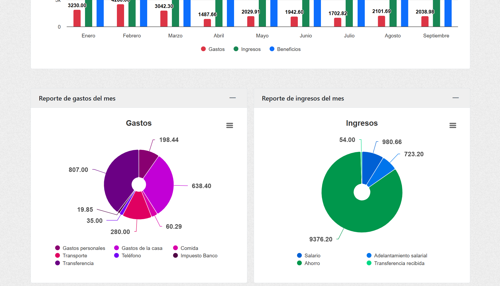
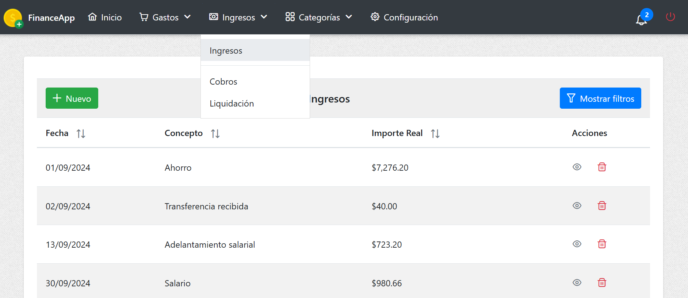
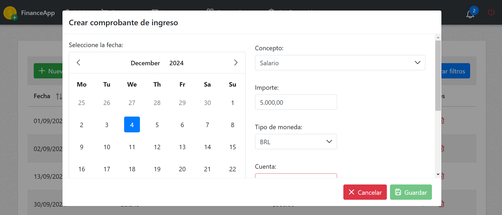

# FinanceApp

**FinanceApp** es una aplicación web desarrollada en Angular 13.0.0 diseñada para gestionar ingresos y gastos de manera eficiente, ya sea a nivel personal o para pequeñas empresas. Ofrece herramientas para organizar las finanzas mensuales y anuales, con una interfaz intuitiva y gráficos interactivos que facilitan el análisis y la toma de decisiones.  

---

## Librerías utilizadas

- **[NgPrime](https://primeng.org/)**: Biblioteca de componentes UI para Angular.
- **[Highcharts](https://www.highcharts.com/)**: Biblioteca para crear gráficos interactivos.

---

## Requisitos previos

Asegúrate de tener instalado:

- [Node.js](https://nodejs.org/) (Recomendado tener Node 14.15.0 - 16.13.0 para Angular 13.0.0).
- [Angular CLI](https://angular.io/cli) (versión 13.0.0).

---

## Instalación y ejecución

1. Clona este repositorio en tu máquina local `git clone https://github.com/fhidalgorosabal/frontend-finance-app.git`.
2. Accede a la carpeta del proyecto `cd frontend-finance-app`.
3. Ejecuta `npm install` para instalar los paquetes de node.
4. Para iniciar la aplicación `ng serve` y accede en el navedador a `http://localhost:4200/`.
   
---   

## Capturas de pantalla

### Login

### Dashboard

### Gráficos interactivos

### Listado de ingresos

### Capturar ingreso

---

## Autor

Desarrollado por: Fernando Hidalgo Rosabal.

---

## Licencia

Este proyecto está licenciado bajo la [Licencia MIT](https://opensource.org/licenses/MIT).

---
